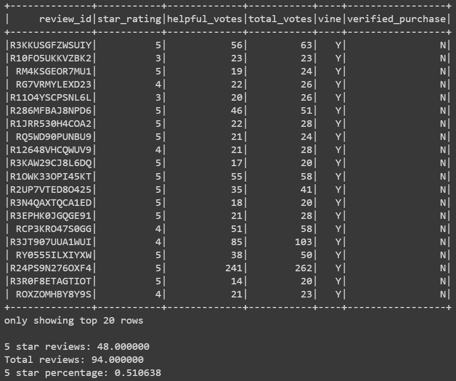
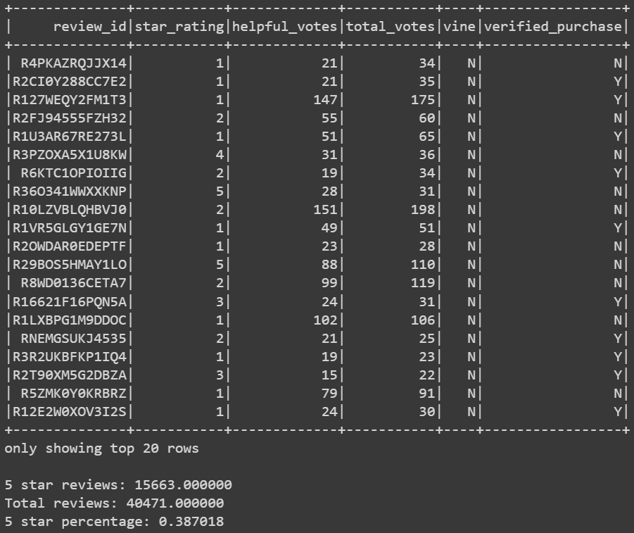

# Amazon Vine Analysis
## Overview
In this analysis I examined Amazon reviews of video games, and compared the reviews by members of the paid Amazon Vine program and by non-members. The dataset I used is stored on Amazon S3. Using PySpark I performed the ETL process to extract the dataset, transform the data, connect to an AWS RDS instance, and load the transformed data into pgAdmin. I further used PySpark to filter the review dataset to compare the effect of Amazon Vine on the review score.

## Results
The outputs from the PySpark code are shown in Figure 1 and 2 for the Amazon Vine reviews and the non-Amazon Vine reviews respectively.

Figure 1. 

Figure 2. 

## Summary
